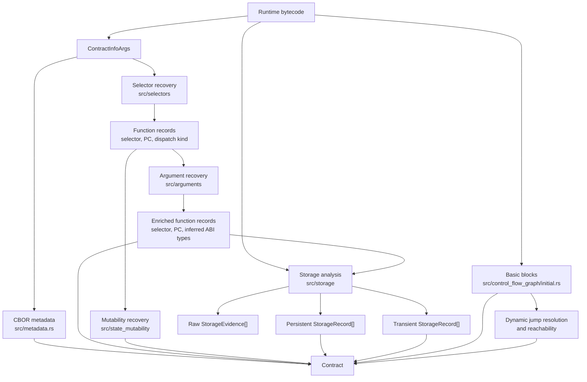
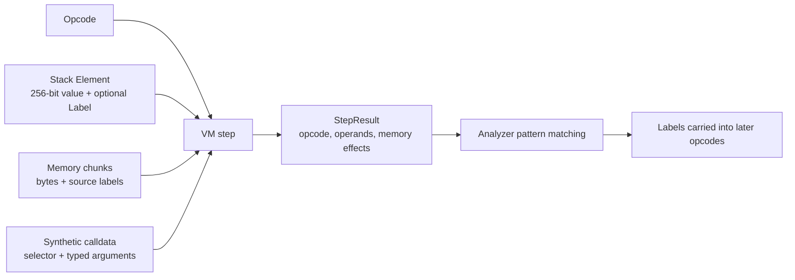
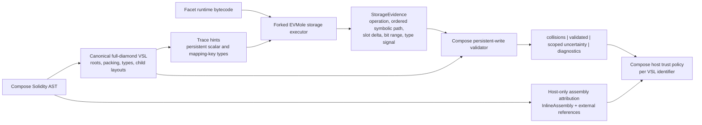

# Compose Bytecode Validator Architecture

This document describes the current Rust architecture of the Compose bytecode
validator fork. It retains EVMole's symbolic execution engine as its analysis
substrate and adds a Compose-specific persistent-write validator.

The engine accepts deployed/runtime EVM bytecode. Creation bytecode is not
executed or stripped automatically.

## Purpose

The inherited EVMole engine uses lightweight symbolic execution to recover
facts from runtime bytecode without source or an ABI:

- external function selectors and dispatcher targets;
- inferred ABI argument types;
- inferred state mutability;
- persistent and transient storage records;
- optional disassembly, basic blocks, control-flow graph, and CBOR metadata.

The public Rust entry point is `contract_info(ContractInfoArgs)`. Builder flags
select the analyses to run. Requesting storage also enables selector and
argument recovery because storage tracing executes each discovered function
with inferred calldata.

## End-to-End Flow



Selector, argument, mutability, and storage analyzers use the same custom EVM
interpreter but run separately. A recovered argument type is therefore an input
to storage tracing, not a global compiler-style type system.

## Layers

| Layer | Main files | Responsibility |
| --- | --- | --- |
| Public API and orchestration | `src/lib.rs`, `src/contract_info.rs` | Defines `ContractInfoArgs`, runs requested analyzers, and returns `Contract`. |
| EVM execution substrate | `src/evm/` | Decodes opcodes, maintains stack/memory/calldata, and emits `StepResult`. |
| Function discovery | `src/selectors/` | Recovers selectors, function-entry PCs, and ABI/fallback dispatch classification. |
| ABI recovery | `src/arguments/` | Traces calldata validation and use to infer Solidity-like parameter types. |
| Mutability recovery | `src/state_mutability/` | Infers payable/view/pure/nonpayable behavior from opcode effects. |
| Storage recovery | `src/storage/` | Traces storage access, slot derivation, shifts, masks, and inferred types. |
| CFG | `src/control_flow_graph/` | Builds basic blocks, resolves supported dynamic jumps, and retains reachable blocks. |
| Bindings | `src/interface_js.rs`, `src/interface_py.rs`, `src/interface_wasm.rs` | Exposes Rust analysis to JavaScript/WASM, Python, and Go. |

## Symbolic Execution Model

Each analyzer creates a `Vm<Label, CallData>` and repeatedly calls `vm.step()`.
The VM performs ordinary EVM stack and memory operations, while the analyzer
adds domain-specific labels to values.



`Label` is the central mechanism. Selector analysis labels values derived from
the first calldata word as a function signature. Argument analysis labels
calldata regions as parameter values. Storage analysis labels typed calldata,
loaded storage, boolean checks, and symbolic `KECCAK256` slot expressions.

Memory retains labelled chunks. Storage analysis can therefore inspect the
preimage written before `KECCAK256`, instead of treating every hash as an
unrelated value.

Each analyzer has a gas/instruction budget. Storage analysis also forks the VM
at supported `JUMPI` branches, recursively explores an alternate destination,
and bounds recursion depth. This is path exploration, not full decompilation.

## Function Recovery

`src/selectors/mod.rs` runs a synthetic call against the dispatcher. It
recognizes comparison patterns such as `EQ`, `XOR`, and `SUB`, then records
the selector and `JUMPI` destination. It also handles several Vyper
dense/sparse dispatcher forms.

Each recovered function contains:

```text
selector
bytecode offset of function body
dispatch: abi | fallback
```

`src/arguments/mod.rs` starts at that function entry point. It traces synthetic
calldata and learns types from validation and use patterns: masks, `ISZERO`,
`SIGNEXTEND`, arithmetic, array access, and ABI bounds checks. The result is a
best-effort list of `DynSolType` values.

Argument recovery deliberately stops decoder-focused logic after effects such
as storage access or calls. It answers "what ABI shape does this function
accept?", not "what storage slot does it access?".

## Storage Recovery

`contract_storage()` executes each discovered function with its inferred
argument list, then also probes the fallback path. Synthetic calldata gives a
mapping-key expression an initial type anchor when the key comes from a
function parameter.

Persistent and transient domains are tracked separately. The internal slot
expression can represent:

```text
plain slot
keccak(constant preimage)
mapping(key type, base slot expression)
dynamic array(base slot expression)
unknown hash preimage
```

`DELEGATECALL` is also retained as raw `DelegateCallEvidence`: target
provenance, forwarded calldata selector when recoverable, caller selector, and
program counter. This evidence is not part of EVMole's public decompiler
storage record.

Important opcode patterns:

```text
SLOAD / TLOAD
  slot expression -> loaded storage element

KECCAK256 over 64 bytes
  key || base slot -> mapping path

KECCAK256 over 32 bytes
  base slot -> dynamic-array data root

ADD / SUB on a slot expression
  preserves the symbolic slot label for later member/element access

SHR / DIV after SLOAD
  records byte offset of a packed field

AND / SIGNEXTEND / ISZERO / BYTE / EQ
  infers shapes such as uint width, address, bytes, signed integer, or bool

SSTORE / TSTORE
  infers a written type and recognizes common read-modify-write packed updates
```

At the end, EVMole groups accesses by concrete slot and byte offset, then emits
one public `StorageRecord` per group: slot, byte offset, a single inferred
Solidity-like type, and the selectors that read or write it.

This finalization makes a compact decompiler report, but it intentionally picks
one best inferred type. It can discard evidence important to Compose, notably
the exact packed width and consumer pattern of a mapping value that is a struct
member.

The fork retains a parallel `StorageEvidence` stream before that collapse. Each
write evidence item includes the persistent/transient domain, selector, PC,
concrete root when recoverable, packed byte offset and width, recovered value
type, and an ordered symbolic path. The path can retain mapping layers,
dynamic-array elements with recovered stride, and constant slot offsets.

## Control-Flow Graph

CFG construction is optional and independent from the storage executor:

1. `initial.rs` splits bytecode into basic blocks.
2. `resolver.rs` symbolically resolves supported dynamic jump targets and
   records parent paths.
3. `reachable.rs` removes blocks unreachable from bytecode PC `0`.

Storage tracing has its own bounded branch forking because it must carry the
complete labelled runtime state into each explored path. The CFG is useful
structural output, but is not currently the source of storage records.

## Language Boundaries

Rust is the analysis source of truth. Bindings expose serialized `Contract`
data:

```text
Rust API
  -> wasm-bindgen JavaScript package
  -> Python pyo3 module
  -> C-ABI WASM used by Go/wazero
  -> JavaScript JSON CLI, MCP adapter, and agent skill
```

For Compose, the natural integration target is the JavaScript/WASM boundary.
The CLI should pass structured validation input to a Compose-specific Rust API;
it should not spawn `cargo` or parse human-readable CLI output.

## Compose Validator Layer

`src/storage_validation/` is the active Compose host. It accepts one facet's
runtime bytecode plus the canonical full-diamond Virtual Storage Layout (VSL).
The VSL is a source-side input generated from Solidity's compact AST; it
contains root identities, physical packing/slot rules, container semantics, and
virtual child records for structs inside containers.

The public validator entry point is:

```rust
storage_validation::validate(&StorageValidationInput {
    bytecode,
    virtual_storage_layout,
}) -> StorageValidationReport
```

For on-chain delegatecall handling, Compose uses:

```rust
storage_validation::validate_with_delegate_calls(
    &input,
    &runtime_code_source,
    DelegateCallValidationContext {
        storage_address: original_diamond_address,
        max_depth,
    },
)
```

`bytecode` is one facet's deployed runtime bytecode. `virtual_storage_layout`
is the complete canonical layout that Compose produced for the selected
diamond. The input deliberately has no fixture name, contract name, or
case-specific fixture mode; those exist only in the research runner.

The validator uses VSL twice, for distinct purposes:

1. `storage_trace_hints()` supplies known persistent scalar and mapping-key
   types to the generic tracer. Hints only improve symbolic recovery; they do
   not make a compatibility decision.
2. The recursive matcher compares recovered persistent writes with the VSL.
   It follows the ordered storage path through mappings, dynamic arrays,
   offsets, and virtual struct children.

It reports four direct-storage evidence collections:

- `collisions` for proven contradictions;
- `validatedVariables` for recovered writes compatible with VSL;
- `uncertainScopes` for unresolved writes at a concrete storage location;
- `diagnostics` when even the storage root cannot be recovered.

`delegatecallWarnings` is a separate, non-blocking collection for a target
that cannot be followed. It is intentionally not an `uncertainScopes` entry:
the warning describes code reachability, not an unresolved persistent storage
write.

The active validator consumes persistent `StorageEvidence` after symbolic
tracing but before EVMole's final slot-record collapse. It validates root slot,
packed offset, bit width, scalar/container semantics, dynamic-array element
stride, and nested container/virtual-struct paths. The fixture families
exercise the same recursive path matcher for mapping structs, array structs,
and mapping-to-array-to-struct layouts.

The matcher has generic transition rules rather than fixture rules:

1. A plain storage path uses VSL's physical slot and packed-byte table to select
   the field at the recovered slot and offset.
2. A path containing mapping, dynamic-array, or slot-offset segments walks the
   matching VSL container schema in order.
3. A path that terminates at a dynamic-array schema validates an array-header
   write; a path that continues through the array is matched against its
   element schema and, when available, its recovered stride.
4. Entering a virtual struct moves to its child record, whose physical slot and
   packing table select the final field.
5. One compatible terminal member beneath a mapping or array does not prove the
   complete element shape. It remains scoped uncertainty until recovered writes
   cover at least two distinct `(member slot, packed offset)` positions under
   the same virtual struct child. Clear type, width, or path contradictions are
   still collisions with only one recovered member.

Fixtures supply different bytecode and canonical VSL inputs to challenge these
same transitions. They do not register handling code for individual Solidity
patterns.

`src/compose/` contains earlier unbiased and VSL-bias experiments. They are
research comparisons, not part of the active verdict.



The primary seam is `src/storage/mod.rs`, after a storage access has a symbolic
slot expression and before `finalize_slot_records()` groups and flattens it.
`StorageEvidence` retains:

- read/write operation and persistent/transient domain;
- selector and program counter;
- symbolic root and ordered mapping, dynamic-array, and constant-slot path;
- slot delta from a known root where recoverable;
- packed bit offset and selected width;
- observed type signal and whether the value type was actually recovered.

The Rust engine deliberately has no inline-assembly detector. A recovered
`SSTORE` with a concrete root and ordered path follows the same VSL matcher as
Solidity-generated bytecode. A caller-provided or otherwise unrecoverable root,
or a packed composite whose member type is lost, remains scoped uncertainty.

Custom storage coordinate systems also remain scoped uncertainty when their
derivation cannot be reduced to a declared VSL root plus its Solidity mapping
or array path. Fixture 11 demonstrates this with Solady-style ERC721 ownership
slots derived from a seed and a non-standard hash-plus-id offset formula.

Compose's future TypeScript host policy belongs above this verdict. It can scan
the current Solidity AST for `InlineAssembly` and use Yul external references
to attribute the block to a VSL identifier. Compatible Rust evidence for that
identifier is reference evidence, not a safe domain verdict; a Rust collision
is never downgraded. An assembly block with no attributable identifier is a
facet-level warning. This source-side annotation cannot prove whether a
historical on-chain bytecode version originated in assembly, so it must remain
separate from the bytecode verdict.

`src/arguments/mod.rs` remains valuable for recovering calldata type anchors.
`src/storage_validation/vsl.rs` owns VSL decoding, trace hints, and semantic
comparison. `src/storage_validation/mod.rs` owns the recursive VSL path walk
and verdict policy. `src/compose/calldata.rs` is a Compose-only calldata
adapter for forwarded delegatecall payloads; it does not alter the generic
`src/evm/vm.rs` behavior.

The Compose matcher belongs above the generic engine and owns policy:

```text
proven root/path/container/bit-range/type contradiction  -> collision
known storage location with unresolved type/path         -> scoped uncertainty
lone compatible struct projection under a container      -> scoped uncertainty
unresolved storage root                                  -> diagnostic
compatible evidence with sufficient structural support  -> validated variable
```

Delegatecall policy is intentionally narrower:

```text
constant / immutable target                             -> fetch code and trace selector
concrete persistent SLOAD target                        -> read original proxy storage, fetch code, trace selector
calldata / transient / symbolic / unavailable target    -> non-blocking delegatecall warning
```

Recursive delegatecalls reuse the same full-diamond VSL and original storage
address. A `(target, selector)` visited set and configurable maximum depth
prevent cyclic or unbounded traces. `CALLCODE` is not modeled.

Persistent target resolution is snapshot-based: `eth_getStorageAt` reads the
pinned pre-transaction state. The current host has no storage overlay for an
`SSTORE` that precedes `SLOAD` in the same path. Consequently, an
`upgradeAndCall` pattern that installs an implementation and immediately
delegatecalls it is a known unsupported case; the snapshot can identify the
previous implementation rather than the runtime target.

Mapping key type alone should remain diagnostic evidence rather than a storage
collision verdict. Unknown or flattened evidence must never prove `safe`.

## Fork Invariants

- Treat input as runtime bytecode only.
- Keep current public decompiler output intact while adding Compose evidence in
  parallel.
- Do not turn unknown symbolic values into a concrete slot/type merely to
  produce a verdict.
- Keep VSL-derived recovery hints separate from compatibility policy: hints may
  improve tracing but cannot turn ambiguous evidence into a validated result.
- Keep VSL decoding and compatibility policy in the Compose host layer. The
  generic engine recovers bytecode facts; Compose decides the verdict.

## Source Map

| Concern | Primary source |
| --- | --- |
| Analysis orchestration | `src/contract_info.rs` |
| VM execution | `src/evm/vm.rs` |
| Stack and labelled values | `src/evm/stack.rs`, `src/evm/element.rs` |
| Labelled memory | `src/evm/memory.rs` |
| Synthetic calldata | `src/evm/calldata.rs`, `src/arguments/calldata.rs` |
| Selector recovery | `src/selectors/mod.rs` |
| ABI type recovery | `src/arguments/mod.rs` |
| Storage tracing and finalization | `src/storage/mod.rs` |
| VSL decoding and write validation | `src/storage_validation/` |
| CFG | `src/control_flow_graph/` |
| JavaScript binding | `src/interface_js.rs`, `javascript/` |
| WASM C ABI | `src/interface_wasm.rs` |
