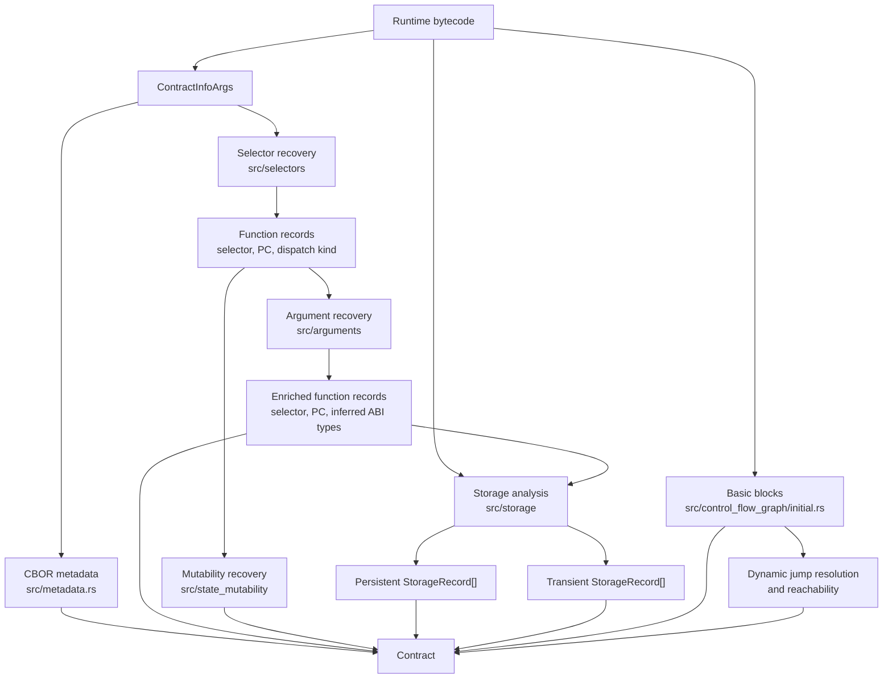
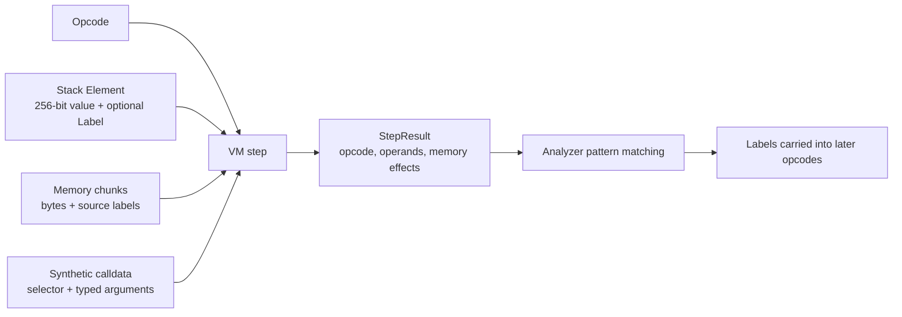
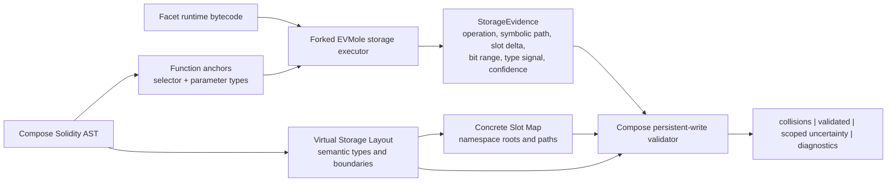

# EVMole Architecture

This document describes the current EVMole Rust implementation at fork baseline
`53a7f6b`. It accepts deployed/runtime EVM bytecode. Creation bytecode is not
executed or stripped automatically.

The final section marks the proposed boundary for Compose bytecode validation.
Everything before that section describes current EVMole behavior.

## Purpose

EVMole uses lightweight symbolic execution to recover facts from runtime
bytecode without source or an ABI:

- external function selectors and dispatcher targets;
- inferred ABI argument types;
- inferred state mutability;
- persistent and transient storage records;
- optional disassembly, basic blocks, control-flow graph, and CBOR metadata.

The public Rust entry point is `contract_info(ContractInfoArgs)`. Builder flags
select the analyses to run. Requesting storage also enables selector and
argument recovery because storage tracing executes each discovered function
with inferred calldata.

## End-to-End Flow



Selector, argument, mutability, and storage analyzers use the same custom EVM
interpreter but run separately. A recovered argument type is therefore an input
to storage tracing, not a global compiler-style type system.

## Layers

| Layer | Main files | Responsibility |
| --- | --- | --- |
| Public API and orchestration | `src/lib.rs`, `src/contract_info.rs` | Defines `ContractInfoArgs`, runs requested analyzers, and returns `Contract`. |
| EVM execution substrate | `src/evm/` | Decodes opcodes, maintains stack/memory/calldata, and emits `StepResult`. |
| Function discovery | `src/selectors/` | Recovers selectors, function-entry PCs, and ABI/fallback dispatch classification. |
| ABI recovery | `src/arguments/` | Traces calldata validation and use to infer Solidity-like parameter types. |
| Mutability recovery | `src/state_mutability/` | Infers payable/view/pure/nonpayable behavior from opcode effects. |
| Storage recovery | `src/storage/` | Traces storage access, slot derivation, shifts, masks, and inferred types. |
| CFG | `src/control_flow_graph/` | Builds basic blocks, resolves supported dynamic jumps, and retains reachable blocks. |
| Bindings | `src/interface_js.rs`, `src/interface_py.rs`, `src/interface_wasm.rs` | Exposes Rust analysis to JavaScript/WASM, Python, and Go. |

## Symbolic Execution Model

Each analyzer creates a `Vm<Label, CallData>` and repeatedly calls `vm.step()`.
The VM performs ordinary EVM stack and memory operations, while the analyzer
adds domain-specific labels to values.



`Label` is the central mechanism. Selector analysis labels values derived from
the first calldata word as a function signature. Argument analysis labels
calldata regions as parameter values. Storage analysis labels typed calldata,
loaded storage, boolean checks, and symbolic `KECCAK256` slot expressions.

Memory retains labelled chunks. Storage analysis can therefore inspect the
preimage written before `KECCAK256`, instead of treating every hash as an
unrelated value.

Each analyzer has a gas/instruction budget. Storage analysis also forks the VM
at supported `JUMPI` branches, recursively explores an alternate destination,
and bounds recursion depth. This is path exploration, not full decompilation.

## Function Recovery

`src/selectors/mod.rs` runs a synthetic call against the dispatcher. It
recognizes comparison patterns such as `EQ`, `XOR`, and `SUB`, then records
the selector and `JUMPI` destination. It also handles several Vyper
dense/sparse dispatcher forms.

Each recovered function contains:

```text
selector
bytecode offset of function body
dispatch: abi | fallback
```

`src/arguments/mod.rs` starts at that function entry point. It traces synthetic
calldata and learns types from validation and use patterns: masks, `ISZERO`,
`SIGNEXTEND`, arithmetic, array access, and ABI bounds checks. The result is a
best-effort list of `DynSolType` values.

Argument recovery deliberately stops decoder-focused logic after effects such
as storage access or calls. It answers "what ABI shape does this function
accept?", not "what storage slot does it access?".

## Storage Recovery

`contract_storage()` executes each discovered function with its inferred
argument list, then also probes the fallback path. Synthetic calldata gives a
mapping-key expression an initial type anchor when the key comes from a
function parameter.

Persistent and transient domains are tracked separately. The internal slot
expression can represent:

```text
plain slot
keccak(constant preimage)
mapping(key type, base slot expression)
dynamic array(base slot expression)
unknown hash preimage
```

Important opcode patterns:

```text
SLOAD / TLOAD
  slot expression -> loaded storage element

KECCAK256 over 64 bytes
  key || base slot -> mapping path

KECCAK256 over 32 bytes
  base slot -> dynamic-array data root

ADD / SUB on a slot expression
  preserves the symbolic slot label for later member/element access

SHR / DIV after SLOAD
  records byte offset of a packed field

AND / SIGNEXTEND / ISZERO / BYTE / EQ
  infers shapes such as uint width, address, bytes, signed integer, or bool

SSTORE / TSTORE
  infers a written type and recognizes common read-modify-write packed updates
```

At the end, EVMole groups accesses by concrete slot and byte offset, then emits
one public `StorageRecord` per group: slot, byte offset, a single inferred
Solidity-like type, and the selectors that read or write it.

This finalization makes a compact decompiler report, but it intentionally picks
one best inferred type. It can discard evidence important to Compose, notably
the exact packed width and consumer pattern of a mapping value that is a struct
member.

## Control-Flow Graph

CFG construction is optional and independent from the storage executor:

1. `initial.rs` splits bytecode into basic blocks.
2. `resolver.rs` symbolically resolves supported dynamic jump targets and
   records parent paths.
3. `reachable.rs` removes blocks unreachable from bytecode PC `0`.

Storage tracing has its own bounded branch forking because it must carry the
complete labelled runtime state into each explored path. The CFG is useful
structural output, but is not currently the source of storage records.

## Language Boundaries

Rust is the analysis source of truth. Bindings expose serialized `Contract`
data:

```text
Rust API
  -> wasm-bindgen JavaScript package
  -> Python pyo3 module
  -> C-ABI WASM used by Go/wazero
  -> JavaScript JSON CLI, MCP adapter, and agent skill
```

For Compose, the natural integration target is the JavaScript/WASM boundary.
The CLI should pass structured validation input to a Compose-specific Rust API;
it should not spawn `cargo` or parse human-readable CLI output.

## Compose Validation Extension Boundary

The active validation host lives in `src/storage_validation/`. It consumes the
canonical full-diamond VSL and persistent write evidence from one facet's
runtime bytecode. It reports four independent evidence collections:

- `collisions` for proven contradictions;
- `validatedVariables` for recovered writes compatible with VSL;
- `uncertainScopes` for unresolved writes at a concrete storage location;
- `diagnostics` when even the storage root cannot be recovered.

The earlier experiments remain in `src/compose/` for comparison:

- `compose` keeps bytecode inference independent and applies VSL afterward.
- `compose_vsl_bias` allows VSL physical slot constraints to resolve selected
  ambiguous inference, while recording every such resolution as an assumption.

The active validator consumes storage evidence after symbolic tracing but
before EVMole's final slot-record collapse. It covers root slot, packed offset,
bit width, and scalar/container VSL token semantics. Container child member
paths are currently scoped uncertainty until mapping and array child path
reconstruction is connected to VSL child records. No collision is not a
complete compatibility proof because unreachable paths remain outside the
evidence set.

The fork should preserve EVMole's existing `StorageRecord` output for upstream
compatibility and add a parallel raw evidence stream before storage
finalization.



The primary seam is `src/storage/mod.rs`, immediately after a storage access
has a symbolic slot expression and before `finalize_slot_records()` groups and
flattens it. `StorageEvidence` retains:

- read/write operation and persistent/transient domain;
- selector and program counter;
- symbolic root, mapping, dynamic-array, and constant-slot path;
- slot delta from a known root where recoverable;
- packed bit offset and selected width;
- observed type signal and whether the value type was actually recovered.

`src/arguments/mod.rs` remains valuable as a source of reusable type-recognition
patterns and optional known function anchors. It is not the correct layer to
compare Virtual Storage Layout entries.

The Compose matcher belongs above the generic engine and owns policy:

```text
proven root/path/container/bit-range/type contradiction -> collision
known storage location with unresolved type/path        -> scoped uncertainty
unresolved storage root                                 -> diagnostic
recovered evidence compatible with VSL                  -> validated variable
```

Mapping key type alone should remain diagnostic evidence rather than a storage
collision verdict. Unknown or flattened evidence must never prove `safe`.

## Fork Invariants

- Treat input as runtime bytecode only.
- Keep current public decompiler output intact while adding Compose evidence in
  parallel.
- Do not turn unknown symbolic values into a concrete slot/type merely to
  produce a verdict.
- Keep selector/parameter anchors explicit in the validation API. EVMole may
  infer them when absent, but Compose source data is stronger evidence.
- Keep Virtual Storage Layout and Slot Map outside the generic engine. The
  engine recovers bytecode facts; Compose decides compatibility policy.

## Source Map

| Concern | Primary source |
| --- | --- |
| Analysis orchestration | `src/contract_info.rs` |
| VM execution | `src/evm/vm.rs` |
| Stack and labelled values | `src/evm/stack.rs`, `src/evm/element.rs` |
| Labelled memory | `src/evm/memory.rs` |
| Synthetic calldata | `src/evm/calldata.rs`, `src/arguments/calldata.rs` |
| Selector recovery | `src/selectors/mod.rs` |
| ABI type recovery | `src/arguments/mod.rs` |
| Storage tracing and finalization | `src/storage/mod.rs` |
| CFG | `src/control_flow_graph/` |
| JavaScript binding | `src/interface_js.rs`, `javascript/` |
| WASM C ABI | `src/interface_wasm.rs` |
